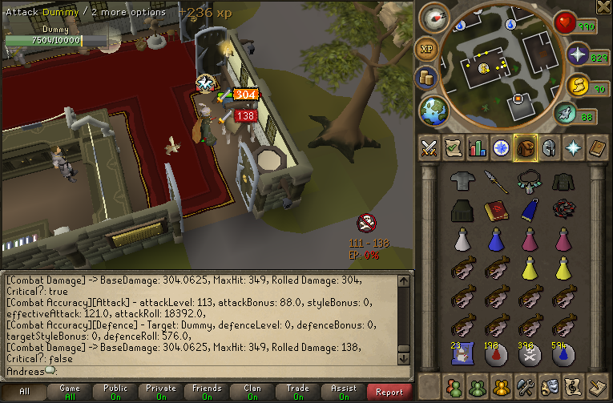
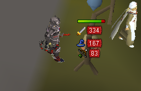

# Avalon source

A RuneScape private server framework, based on client build 718, loading a 727 cache. Using a Matrix codebase.

## Getting Started

Place the contents of the cache zip into the /data/cache/ directory.

[Cache](https://mega.nz/file/8cwFCZqD#fK2d_l84JRm_wOWbBrNmq985h4Wc4bCu71tFRCRdWrw)

[Client](https://mega.nz/file/UdpyEDQD#uGZ96ZIj7TNiUAfvw81TX0zOv8a5428ack-zFAlOfAw)

[Discord](https://discord.gg/7q2n6jXKcW)

Run the server using `Launcher.java` or by running the jar from the command line using

`java -jar Client.jar`

The server may throw an error for /data/cache/ not being present. Make sure this is added!

Requires JDK 21.

## Credits
- Jagex, for RuneScape.
- Matrix team
- Avalon team
- Rune-Server
